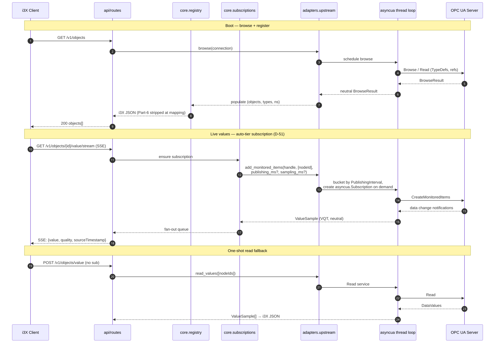

<!-- _class: lead -->

# i3xua

A Python gateway from **OPC UA** to the CESMII **i3X v1.0** spec.

*5-minute walkthrough — what it is, how to run it, how to check it.*

---

## What it does


- Maintains live OPC UA sessions; mirrors address spaces into i3X.
- Exposes browse / read / subscribe / history endpoints over HTTP + SSE.

*Translator between two industrial-data dialects.*

---

## Architecture — hexagonal



*Only `adapters/asyncua/*` imports asyncua. Enforced via `lint-imports`.*

---

## Request paths



*Browse on demand. Subscribe creates real OPC UA MonitoredItems (no polling).*

---

<style scoped>
section { font-size: 20px; }
section pre, section code { font-size: 0.85em; }
</style>

## 1. Configure `config.yaml`

Copy `config.example.yaml`; edit the `connections:` block.

```yaml
server:
  host: 127.0.0.1
  port: 8080
  auth:
    mode: bearer
    tokens: [your-secret-token]

connections:
  - name: my-server
    endpoint: opc.tcp://plc.example:4840
    channel:
      mode: SignAndEncrypt
      policy: Aes256Sha256RsaPss
      client_cert_path:      /certs/client.der
      client_key_path:       /certs/client.pem
      server_trust_list_dir: /certs/trusted/
    user:
      type: username
      username: opcuser
      password: ${OPCUA_VENDOR_PW}
    namespace_allowlist: []
```

Per-connection knobs: `endpoint`, `channel`, `user`, `namespace_allowlist`,
`browse_variable_properties` (true for Reference Server / Alarms,
false for Kepware-class tag servers).

*One YAML, one or more upstream OPC UA servers.*

---

## 2. Start via CLI

```bash
./run.sh config.yaml
# or:
uv run i3xua --config config.yaml
```

- Default API port: **8080**.
- Bearer token from `server.auth.tokens` in the config.
- Per-connection asyncio thread; one OPC UA session per connection.

*Single command. The wrapper handles reconnect + auto-tier subscriptions.*

---

## 3. Check status via UI

Open `http://localhost:8080/admin/ui` — paste bearer token.

**Top half** — live runtime status:

- Connections, namespaces, type / instance counts.
- Active subscriptions, history depth.
- Per-connection browse-phase timings.

**Bottom half** — **Run health check** button:

- Click → runs the static-analysis battery (~15-30 s).
- Result renders in the iframe below.
- Click again to re-run.

*One pane of glass for both runtime and code-quality state.*

---

## 4. CI / static analysis

13 checks, same battery local + CI + the andon UI:

| Tier         | Tools                                      |
| ------------ | ------------------------------------------ |
| style        | ruff format / lint                         |
| types        | mypy --strict, pyright (non-blocking)      |
| architecture | import-linter (3 hexagonal contracts)      |
| security     | bandit, pip-audit                          |
| quality      | vulture, xenon, radon, interrogate, pydeps |
| tests        | pytest + coverage (≥65% floor)             |

```bash
uv run python tools/andon_report.py
# writes andon-report.html; non-zero exit if anything is RED
```

*Green andon page locally ⇒ green CI.*
